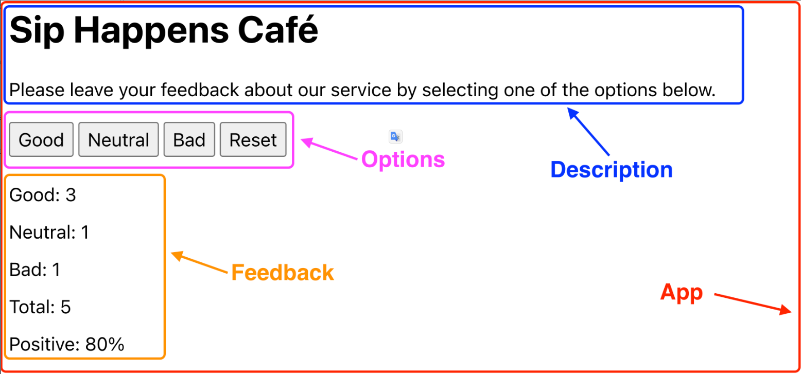
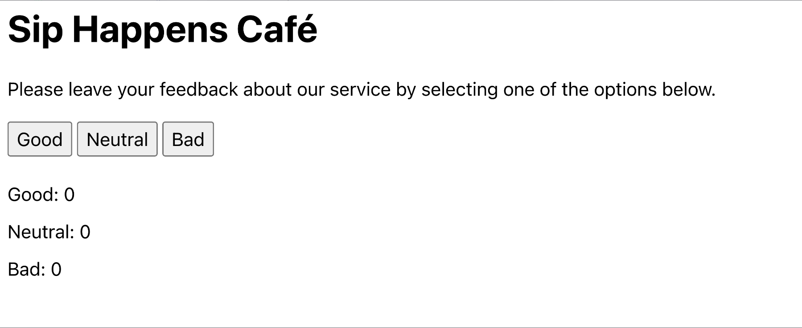

# Домашнє завдання `goit-react-hw-02`
## Віджет відгуків
Напиши застосунок для збору відгуків про кав'ярню **Sip Happens Café**. Подивись демо-відео роботи застосунку.
<iframe width="778" height="438" src="https://www.youtube.com/embed/fPaqeL_J4Dk" title="Віджет відгуків" frameborder="0" allow="accelerometer; autoplay; clipboard-write; encrypted-media; gyroscope; picture-in-picture; web-share" referrerpolicy="strict-origin-when-cross-origin" allowfullscreen></iframe>

Застосунок повинен відображати кількість зібраних відгуків для кожної категорії: `good`, `neutral`, `bad`. Застосунок повинен зберігати статистику відгуків між оновленням сторінки.

#### Компоненти
В цьому завданні інтерфейс вже розділений на компоненти, твоя задача перенести це в код. Частини інтерфейсу, що входять в компонент, обведені рамкою відповідного кольору.



Як бачиш, всі компоненти рендеряться всередині компонента **App**.

Назва кав'ярні

```
Sip Happens Café
```

Текст опису

```
Please leave your feedback about our service by selecting one of the options below.
```

#### Крок 1
У компоненті **App** створи стан для зберігання типів відгуків. Нехай це буде об'єкт з одноіменними властивостями:

```js
{
	good: 0,
	neutral: 0,
	bad: 0
}
```
Оголоси компоненти **Feedback** та **Options** і використовуй їх в **App** для відображення опцій та фідбека. Для цього передай необхідні значення їм через пропси.

Після цього кроку інтерфейс застосунку буде виглядати наступним чином. Зверни увагу, що в компонентів не вистачає деяких елементів, ти додаси їх наступних кроках.


#### Крок 2
Додай обробник стану, щоб при кліках по кнопках в компоненті **Options** змінювався стан компонента **App**.

Оголоси функцію **updateFeedback(feedbackType)**, яка приймає один параметр - тип фідбеку, тобто ім'я властивості зі стану, рядки **“good”**, **“bad”** або **“neutral”**.

```js
const updateFeedback = feedbackType => {
 // Тут використовуй сеттер, щоб оновити стан
}
```
Передай функцію **updateFeedback** як пропс в компонент **Options** і викликай її при кліках по кнопках, передаючи тип фідбеку (рядки **“good”**, “bad”**** або **“neutral”**) як аргумент.

Після цього кроку при кліках по кнопках в компоненті **Options** буде оновлюватися інтерфейс.

<iframe width="778" height="438" src="https://www.youtube.com/embed/R7_7zxgUUj4" title="Крок 2" frameborder="0" allow="accelerometer; autoplay; clipboard-write; encrypted-media; gyroscope; picture-in-picture; web-share" referrerpolicy="strict-origin-when-cross-origin" allowfullscreen></iframe>

#### Крок 3
Зроби так, щоб компонент **Feedback** рендерився тільки після того, як було зібрано хоча б один відгук. Загальна кількість відгуків - це просто сума станів:

```JS
const totalFeedback = good + neutral + bad;
```
Оскільки стан зберігається в компоненті **App**, то і обчислення **totalFeedback** буде правильно виконувати в цьому компоненті, і передавати вже обчислене значення пропсами іншим компонентам, а також використовувати в **App** для умовного рендерингу.

Повідомлення про відсутність статистики перенеси в компонент **Notification** і відобрази його в **App**. Для цього використовуй умовний рендеринг в компоненті **App**.
<iframe width="778" height="438" src="https://www.youtube.com/embed/0nEIUlmtLug" title="Крок 3" frameborder="0" allow="accelerometer; autoplay; clipboard-write; encrypted-media; gyroscope; picture-in-picture; web-share" referrerpolicy="strict-origin-when-cross-origin" allowfullscreen></iframe>

#### Крок 4
Додай кнопку **Reset** для скидання зібраних відгуків у компонент **Options**. При кліку на неї стан, що відповідає за відгуки, повинен обнулитися. Кнопка **Reset** видима тільки в разі наявності хоча б одного відгуку, так само, як і компонент **Feedback**.

Для умовного рендерингу використовуй попередньо обчислене значення **totalFeedback** з компонента **App** і передавай його як пропс в **Options**.

<iframe width="778" height="438" src="https://www.youtube.com/embed/Ud7td98vD2M" title="Крок 4" frameborder="0" allow="accelerometer; autoplay; clipboard-write; encrypted-media; gyroscope; picture-in-picture; web-share" referrerpolicy="strict-origin-when-cross-origin" allowfullscreen></iframe>


#### Крок 5
Розшир функціонал застосунку таким чином, щоб в інтерфейсі відображалося більше статистики про зібрані відгуки. Додай відображення загальної кількості зібраних відгуків з усіх категорій та відсоток позитивних відгуків. Це всі обчислювані значення, які не потрібно зберігати в стані. Передай ці значення через пропси в відповідні компоненти.

Загальна кількість відгуків - це просто сума станів:
```js
const totalFeedback = good + neutral + bad;
```
Для підрахунку відсотка позитивних відгуків можна використовувати наступну формулу:

```js
Math.round((good / totalFeedback) * 100)
```

Зверни увагу, що для значень **totalFeedback** і **positiveFeedback** не потрібно створювати окремі властивості в стані, оскільки це дані, що легко обчислюються на основі існуючого стану. Це не тільки оптимізує використання пам'яті та ресурсів, але й зменшує ризик виникнення помилок, пов'язаних із не синхронізованим станом даних.

Після цього кроку інтерфейс застосунку буде завершений.
<iframe width="778" height="438" src="https://www.youtube.com/embed/GONOudaWuhM" title="Крок 5" frameborder="0" allow="accelerometer; autoplay; clipboard-write; encrypted-media; gyroscope; picture-in-picture; web-share" referrerpolicy="strict-origin-when-cross-origin" allowfullscreen></iframe>

#### Крок 6
Зроби так, щоб статистика відгуків зберігалася між перезавантаженнями сторінки. Використовуй ефекти та локальне сховище для збереження стану при його зміні, а при завантаженні сторінки ініціалізуй стан і локальне сховище для зчитування збережених даних та запису їх у стан. Якщо на момент завантаження додатка в локальному сховищі нічого не збережено, стан повинен ініціалізуватися нулями.
